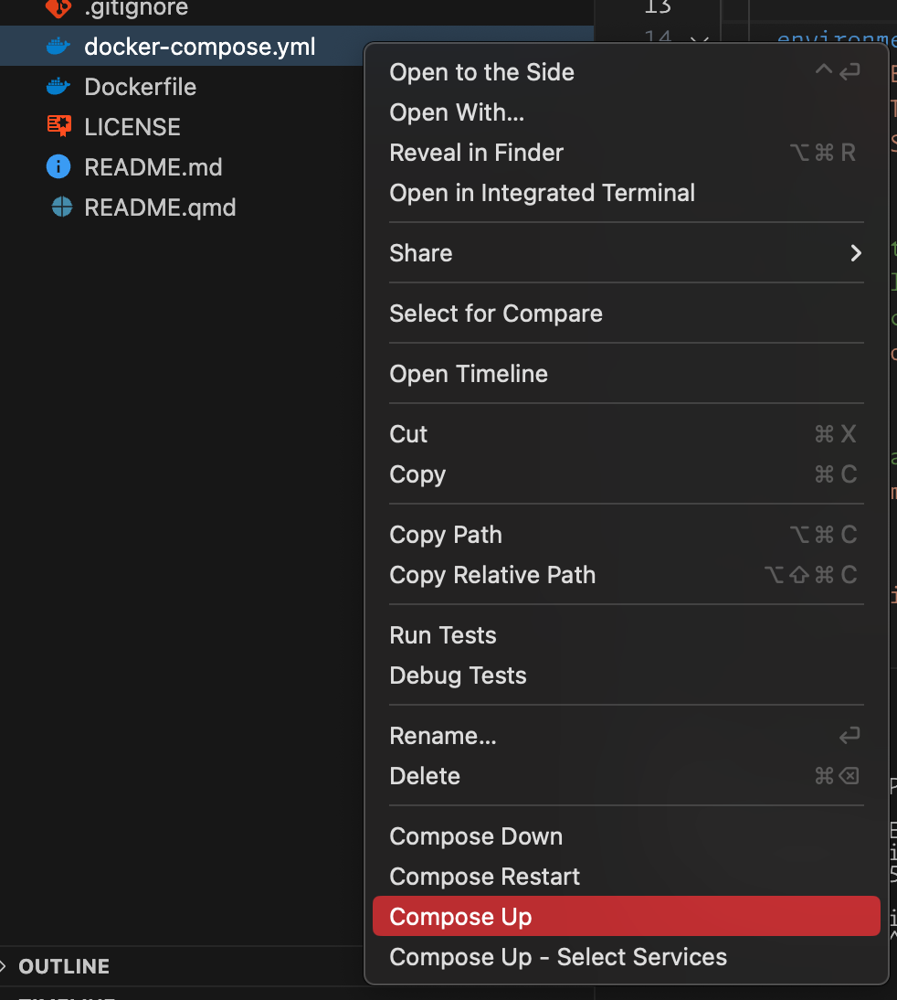

# “Pandemic Pass?” replication code


- [Getting started](#getting-started)
- [Method 1: Docker Compose
  (recommended)](#method-1-docker-compose-recommended)
- [Method 2: {renv} locally](#method-2-renv-locally)

<!-- README.md is generated from README.qmd. Please edit that file -->
This is a Docker container to help with the replication of [“Pandemic
Pass”](https://github.com/andrewheiss/mountainous-mackerel)

------------------------------------------------------------------------

To maximize replicability, we wrote the manuscript using
[Quarto](https://quarto.org/), which allowed us to mix computational
figures, text, and tables with the actual prose of the manuscript. This
means that there’s no need to rely on comments within code to identify
the location of each appropriate result in the manuscript—all results
are programmatically included when rendering the document.

We use the [{renv}
package](https://rstudio.github.io/renv/articles/renv.html) to create a
stable version-specific library of R packages, and we use the [{targets}
package](https://docs.ropensci.org/targets/index.html) to manage all the
file dependencies and run the analysis. {targets} is especially helpful
with long-running objects like the main models, which take ≈40 minutes
to run—as long as upstream dependencies don’t change, the models only
need to run once, and can be loaded from {targets}’s data store
thereafter.

Because it can sometimes be difficult to set up and configure
version-specific libraries of R packages and install specific versions
of Stan, we provide two methods for replicating our analysis: (1) a
Docker container built and orchestrated with Docker Compose, or (2)
restoring a {renv} environment on your local computer.

The original pre-cleaned data for the analysis is accessible in
`mountainous-mackerel/data/raw_data`. The {targets} pipeline cleans this
data and creates objects named `weekly_panel` and `quarterly_panel`—load
them into an R session with `targets::tar_load(weekly_panel)` or
`targets::tar_load(quarterly_panel)`.

------------------------------------------------------------------------

The complete {targets} pipeline generates two output artifacts:

- **Manuscript**: HTML and PDF versions of the manuscript and appendix,
  located at `mountainous-mackerel/manuscript/output/` (or at
  [`http://localhost:8888/analysis/paper.html`](http://localhost:8888/analysis/paper.html)
  if you run the pipeline with Docker Compose).
- **Analysis notebook**: A static website containing more complete
  details about the data, hypotheses, statistical methods, model
  diagnostics, and other information, located at
  `mountainous-mackerel/_site` (or at
  [`http://localhost:8888`](http://localhost:8888) if you run the
  pipeline with Docker Compose).

## Getting started

The repository for the paper itself is accessible at
<https://github.com/andrewheiss/mountainous-mackerel> and should be
cloned into this repository into a folder named `mountainous-mackerel`.
You can either download the repository from GitHub or run this command
in the terminal:

``` sh
git clone https://github.com/andrewheiss/mountainous-mackerel.git
```

Make sure the folder structure looks like this:

``` text
.
├── README.md
├── README.pdf
├── docker-compose.yml
├── Dockerfile
├── ...
├── img/
├── ...
└── mountainous-mackerel
    ├── README.md
    ├── mountainous-mackerel.Rproj
    └── ...
```

## Method 1: Docker Compose (recommended)

The entire analysis can be run in a Docker container based on R 4.4.0,
with all packages locked at specific versions defined in
`mountainous-mackerel/renv.lock`.

Here’s how to do this:

1.  Install Docker Desktop on your computer (instructions for
    [macOS](https://docs.docker.com/desktop/install/mac-install/) or
    [Windows](https://docs.docker.com/desktop/install/windows-install/)).

2.  Make sure Docker is running.

3.  In the Docker Desktop settings, make sure you allocate at least 8
    CPUs and 16 GB of RAM.

    

4.  Build the analysis with Docker Compose. There are two general
    approaches:

    - **Using Visual Studio Code or Positron *(recommended)***: If you
      [download Visual Studio Code](https://code.visualstudio.com/) or
      [Positron](https://github.com/posit-dev/positron) and [its Docker
      extension](https://code.visualstudio.com/docs/containers/overview),
      you can right click on the `docker-compose.yml` file in the File
      Explorer sidebar and select “Compose Up”.

      

    - **Using the terminal**: Using a terminal, navigate to this
      replication code directory and run this:

      ``` sh
      docker compose -f docker-compose.yml up
      ```

5.  Wait for the container to build. It takes 60–70 minutes to build the
    {renv} library (but only the first time you run this; subsequent
    runs of `docker compose` should be instant), and it takes about
    30–40 minutes to run the analysis (but only the first time;
    subsequent runs of `targets::tar_make()` should be instant).

6.  Visit [`http://localhost:8787`](http://localhost:8787) and open an
    RStudio session inside the newly-built container in your browser.
    Any edits you make here will also be reflected on your local
    computer.

7.  Run the {targets} pipeline by running `targets::tar_make()` in the R
    console. Wait again; it takes ≈45 minutes to run the models, build
    the statistical notebook website, and render the manuscript in
    multiple formats. Subsequent runs of the pipeline should be fairly
    instant, though.

    > [!NOTE]
    >
    > ### Expected errors
    >
    > For whatever reason, when the pipeline runs in Docker, it will
    > show errors like `Error: object 'who_region' not found` and
    > `Error: cannot open file '/home/rstudio/mountainous-mackerel/renv/staging/1/R6/R/R6.rdb': No such file or directory`.
    >
    > These can be disregarded—everything builds fine and nothing stops
    > with the errors—it’s not clear why those are appearing ::shrug::

8.  When the pipeline is all the way done, visit
    [`http://localhost:8888`](http://localhost:8888) to see the analysis
    notebook and finished manuscript (at
    [`http://localhost:8888/analysis/paper.html`](http://localhost:8888/analysis/paper.html)).

    You can also see these outputs on your computer: the analysis
    notebook is at `mountainous-mackerel/_site` and the manuscript and
    appendix files are at `mountainous-mackerel/manuscript/output/`.

## Method 2: {renv} locally

It’s also possible to not use Docker and instead run everything locally.

1.  Open `mountainous-mackerel/mountainous-mackerel.Rproj` to open a new
    RStudio project.

2.  Run `renv::restore()` to install all the packages.

3.  Run `cmdstanr::install_cmdstan()` to install
    [CmdStan](https://mc-stan.org/users/interfaces/cmdstan).

4.  Run `tinytex::install_tinytex()` to install a mimimal LaTeX
    installation if you don’t have one installed already.

5.  Download and install these fonts (or install them from `misc/fonts`
    in this repository):

    - [Noto Sans](https://fonts.google.com/specimen/Noto+Sans)
    - [Linux Libertine](https://libertine-fonts.org/)
    - [Libertinus
      Math](https://github.com/alerque/libertinus/releases/tag/v7.040)

6.  Run `targets::tar_make()` to run the full analysis pipeline. This
    will take ≈45 minutes the first time.

7.  When the pipeline is all the way done, find the analysis notebook at
    `mountainous-mackerel/_site` and the manuscript and appendix files
    at `mountainous-mackerel/manuscript/output/`.
