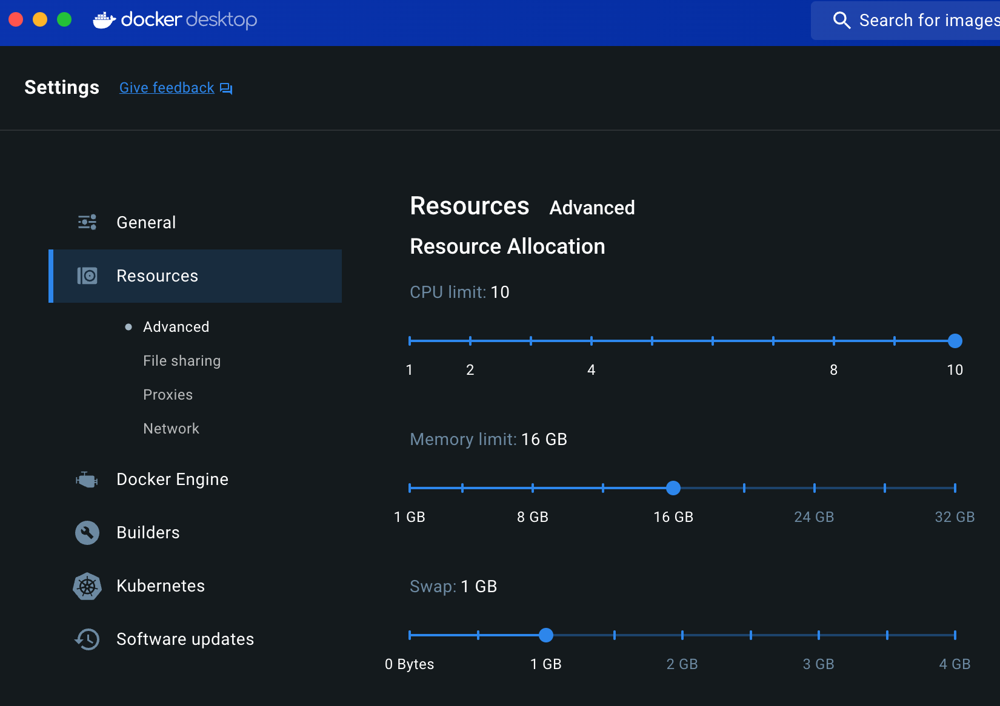

# “Pandemic Pass?” replication code


- [Getting started](#getting-started)
- [Method 1: Docker Compose
  (recommended)](#method-1-docker-compose-recommended)
- [Method 2: Run locally with {renv} and project-specific
  packages](#method-2-run-locally-with-renv-and-project-specific-packages)
- [Method 3: Run locally with packages installed
  systemwide](#method-3-run-locally-with-packages-installed-systemwide)

<!-- README.md is generated from README.qmd. Please edit that file -->
This is a Docker container to help with the replication of [“Pandemic
Pass”](https://github.com/andrewheiss/mountainous-mackerel)

------------------------------------------------------------------------

To maximize replicability, we wrote our manuscript using
[Quarto](https://quarto.org/), which allowed us to mix computational
figures, text, and tables with the actual prose of the manuscript. This
means that there’s no need to rely on comments within code to identify
the location of each appropriate result in the manuscript—all results
are programmatically included when rendering the document.

We use the [{renv}
package](https://rstudio.github.io/renv/articles/renv.html) to create a
stable version-specific library of R packages, and we use the [{targets}
package](https://docs.ropensci.org/targets/index.html) to manage all the
file dependencies and run the analysis. {targets} is especially helpful
with long-running objects like the main models, which take ≈40 minutes
to run—as long as upstream dependencies don’t change, the models only
need to run once, and can be loaded from {targets}’s data store
thereafter.

Because it can sometimes be difficult to set up and configure
version-specific libraries of R packages and install specific versions
of Stan, we provide three methods for replicating our analysis:

1.  **Running a Docker container built and orchestrated with Docker
    Compose.** This is the recommended approach, since the complete
    computational environment will be replicated, including non-R
    software like Quarto, pandoc, LaTeX, dvisvgm, fonts, and other
    auxiliary elements.
2.  **Restoring a project-specific library of all required R packages on
    your computer with {renv}.** This is the next recommended approach,
    since {renv} will install package versions as of July 2024 when we
    ran this code prior to publication. However, you’re responsible for
    installing all the non-R elements, like Quarto and LaTeX (detailed
    instructions are included below).
3.  **Installing the most current versions of all required R packages on
    your computer systemwide.** This is the least recommended approach,
    since the included script will grab the latest version of all R
    packages from CRAN and install them in your system library. As with
    method 2, you’re still responsible for installing all the non-R
    elements on your own.

The original pre-cleaned data for the analysis is accessible in
`mountainous-mackerel/data/raw_data`. The {targets} pipeline cleans this
data and creates objects named `weekly_panel` and `quarterly_panel`—load
them into an R session with `targets::tar_load(weekly_panel)` or
`targets::tar_load(quarterly_panel)`.

------------------------------------------------------------------------

The complete {targets} pipeline generates two output artifacts:

- **Manuscript**: HTML and PDF versions of the manuscript and appendix,
  located at `mountainous-mackerel/manuscript/output/` (or at
  [`http://localhost:8888/analysis/paper.html`](http://localhost:8888/analysis/paper.html)
  if you run the pipeline with Docker Compose).
- **Analysis notebook**: A static website containing more complete
  details about the data, hypotheses, statistical methods, model
  diagnostics, and other information, located at
  `mountainous-mackerel/_site` (or at
  [`http://localhost:8888`](http://localhost:8888) if you run the
  pipeline with Docker Compose).

## Getting started

The repository for the paper itself is accessible at
<https://github.com/andrewheiss/mountainous-mackerel> and should be
cloned into this repository into a folder named `mountainous-mackerel`.
You can either download the repository from GitHub or run this command
in the terminal:

``` sh
git clone https://github.com/andrewheiss/mountainous-mackerel.git
```

Make sure the folder structure looks like this:

``` text
.
├── README.md
├── README.pdf
├── docker-compose.yml
├── Dockerfile
├── ...
├── img/
├── ...
└── mountainous-mackerel
    ├── README.md
    ├── mountainous-mackerel.Rproj
    └── ...
```

## Method 1: Docker Compose (recommended)

The entire analysis can be run in a Docker container based on R 4.4.0,
with all packages locked at specific versions defined in
`mountainous-mackerel/renv.lock`.

Here’s how to do this:

1.  Install Docker Desktop on your computer (instructions for
    [macOS](https://docs.docker.com/desktop/install/mac-install/) or
    [Windows](https://docs.docker.com/desktop/install/windows-install/)).

2.  Make sure Docker is running.

3.  In the Docker Desktop settings, make sure you allocate at least 8
    CPUs and 16 GB of RAM.

    

4.  Build the analysis with Docker Compose. There are two general
    approaches:

    - **Using Visual Studio Code or Positron *(recommended)***: If you
      [download Visual Studio Code](https://code.visualstudio.com/) or
      [Positron](https://github.com/posit-dev/positron) and [its Docker
      extension](https://code.visualstudio.com/docs/containers/overview),
      you can right click on the `docker-compose.yml` file in the File
      Explorer sidebar and select “Compose Up”.

      

    - **Using the terminal**: Using a terminal, navigate to this
      replication code directory and run this:

      ``` sh
      docker compose -f docker-compose.yml up
      ```

5.  Wait for the container to build. It takes ≈10 minutes to build the
    {renv} library (but only the first time you run this; subsequent
    runs of `docker compose` should be instant), and it takes about ≈20
    minutes to run the analysis (but only the first time; subsequent
    runs of `targets::tar_make()` should be instant).

6.  Visit [`http://localhost:8787`](http://localhost:8787) and open an
    RStudio session inside the newly-built container in your browser.
    Any edits you make here will also be reflected on your local
    computer.

7.  Run the {targets} pipeline by running `targets::tar_make()` in the R
    console. Wait again; it takes ≈20 minutes to run the models, build
    the statistical notebook website, and render the manuscript in
    multiple formats. Subsequent runs of the pipeline should be fairly
    instant, though.

    > [!NOTE]
    >
    > ### Expected errors
    >
    > For whatever reason, when the pipeline runs in Docker, it will
    > show errors like `Error: object 'who_region' not found` and
    > `Error: cannot open file '/home/rstudio/mountainous-mackerel/renv/staging/1/R6/R/R6.rdb': No such file or directory`.
    >
    > These can be disregarded—everything builds fine and nothing stops
    > with the errors—it’s not clear why those are appearing ::shrug::

8.  When the pipeline is all the way done, visit
    [`http://localhost:8888`](http://localhost:8888) to see the analysis
    notebook and finished manuscript (at
    [`http://localhost:8888/analysis/paper.html`](http://localhost:8888/analysis/paper.html)).

    You can also see these outputs on your computer: the analysis
    notebook is at `mountainous-mackerel/_site` and the manuscript and
    appendix files are at `mountainous-mackerel/manuscript/output/`.

## Method 2: Run locally with {renv} and project-specific packages

It’s also possible to not use Docker and instead run everything locally
in a special R package library that is separate from your system
library.

0.  Install these preliminary things:

    - **R 4.4.0** (or later) and **RStudio**.

    - **Quarto 1.6.1** (or later). As of this writing, the current
      stable version of Quarto is 1.5; [download 1.6.x from
      GitHub](https://github.com/quarto-dev/quarto-cli/releases).

    - **A C++ compiler and GNU Make**. Complete instructions for macOS,
      Windows, and Linux [are available at CmdStan’s
      documentation](https://mc-stan.org/docs/cmdstan-guide/installation.html#cpp-toolchain).
      In short, do this:

      - **macOS**: Run this terminal command and follow the dialog that
        pops up after to install macOS’s Command Line Tools:

        ``` sh
        xcode-select --install
        ```

      - **Windows**: [Download and install Rtools from
        CRAN](https://cran.r-project.org/bin/windows/Rtools/rtools44/rtools.html)

      - **Linux**: Run this terminal command (depending on your
        distribution; this assumes Ubuntu/Debian):

        ``` sh
        sudo apt install g++ make
        ```

    - (*macOS only*): [Download and install
      XQuartz](https://www.xquartz.org/)

    - **Ghostscript**: The multilevel model diagrams in the appendix are
      drawn with [TikZ](https://en.wikipedia.org/wiki/PGF/TikZ), and
      Quarto uses [dvisvgm](https://dvisvgm.de/) to convert these into
      SVGs instead of PDFs when rendering to non-PDF outputs.

      - **macOS**: The easiest way to install Ghostscript on macOS is
        through Homebrew. Run this terminal command after installing
        Homebrew:

        ``` sh
        brew install ghostscript
        ```

        The resulting system libraries for using it live at
        `/opt/homebrew/opt/ghostscript/lib/libgs.dylib`. This is already
        set as the `LIBGS` environment variable in
        `manuscript/appendix.qmd`.

      - **Windows**: [Download
        Ghostscript](https://ghostscript.com/releases/gsdnld.html) and
        install it.

      - **Linux**: Run this terminal command (depending on your
        distribution; this assumes Ubuntu/Debian):

        ``` sh
        sudo apt install ghostscript
        ```

    - **Fonts**: Download and install these fonts (or install them from
      `misc/fonts` in this repository). On Windows, install these as an
      administrator so that R and Quarto have access to them.

      - [Noto Sans](https://fonts.google.com/specimen/Noto+Sans)
      - [Linux Libertine](https://libertine-fonts.org/)
      - [Libertinus
        Math](https://github.com/alerque/libertinus/releases/tag/v7.040)

1.  Open `mountainous-mackerel/mountainous-mackerel.Rproj` to open a new
    RStudio project.

2.  Run this to install {cmdstanr}. This is supposed to happen
    automatically as part of `renv::restore()` below, since {cmdstanr}
    is in the lockfile, but [due to an issue with
    {renv}](https://github.com/rstudio/renv/issues/1961) (fixed in the
    development version as of 2024-08-06), it doesn’t install correctly
    because it is hosted at <https://stan-dev.r-universe.dev> instead of
    CRAN. So for now, until the next stable release of {renv}, it’s
    easiest to install {cmdstanr} in a separate step.

    ``` r
    install.packages("cmdstanr", repos = c("https://stan-dev.r-universe.dev", "https://packagemanager.posit.co/cran/latest"))
    ```

3.  Run `renv::restore()` to install all the packages.

4.  Run `cmdstanr::install_cmdstan()` to install
    [CmdStan](https://mc-stan.org/users/interfaces/cmdstan).

5.  Run `tinytex::install_tinytex()` to install a mimimal LaTeX
    installation if you don’t have one installed already.

    TinyTex should install any additional LaTeX packages that it needs
    when it comes across anything that’s missing. You can help it along
    by installing those non-core packages first with this R command:

    ``` r
    tinytex::tlmgr_install(
      # tikz things
      c("dvisvgm", "adjustbox", "collectbox", "currfile", "filemod", "gincltex", 
        "standalone", "fp", "pgf", "grfext", "libertine", "libertinust1math",
      # template things
        "nowidow", "tocloft", "orcidlink", "abstract", "titling", "tabularray", 
        "ninecolors", "enumitem", "textcase", "titlesec", "footmisc", "caption", 
        "pdflscape", "ulem", "multirow", "wrapfig", "colortbl", "tabu", 
        "threeparttable", "threeparttablex", "environ", "makecell", "sidenotes", 
        "marginnote", "changepage", "siunitx", "mathtools", "setspace", 
        "ragged2e", "fancyhdr", "pdftex", "preprint")
    )
    ```

6.  *(Finally!)* Run `targets::tar_make()` to run the full analysis
    pipeline. This will take ≈20 minutes the first time.

    > [!NOTE]
    >
    > ### Expected errors
    >
    > For whatever reason, when the pipeline runs it will show errors
    > like `Error: object 'who_region' not found`.
    >
    > These can be disregarded—everything builds fine and nothing stops
    > with the errors—it’s not clear why those are appearing ::shrug::

7.  When the pipeline is all the way done, find the analysis notebook at
    `mountainous-mackerel/_site` and the manuscript and appendix files
    at `mountainous-mackerel/manuscript/output/`.

## Method 3: Run locally with packages installed systemwide

Finally, it’s also possible to not use Docker *and* not use {renv} and
instead run everything using R packages that you install systemwide.

0.  Install these preliminary things:

    - **R 4.4.0** (or later) and **RStudio**.

    - **Quarto 1.6.1** (or later). As of this writing, the current
      stable version of Quarto is 1.5; [download 1.6.x from
      GitHub](https://github.com/quarto-dev/quarto-cli/releases).

    - **A C++ compiler and GNU Make**. Complete instructions for macOS,
      Windows, and Linux [are available at CmdStan’s
      documentation](https://mc-stan.org/docs/cmdstan-guide/installation.html#cpp-toolchain).
      In short, do this:

      - **macOS**: Run this terminal command and follow the dialog that
        pops up after to install macOS’s Command Line Tools:

        ``` sh
        xcode-select –-install
        ```

      - **Windows**: [Download and install Rtools from
        CRAN](https://cran.r-project.org/bin/windows/Rtools/rtools44/rtools.html)

      - **Linux**: Run this terminal command (depending on your
        distribution; this assumes Ubuntu/Debian):

        ``` sh
        sudo apt install g++ make
        ```

    - (*macOS only*): [Download and install
      XQuartz](https://www.xquartz.org/)

    - **Ghostscript**: The multilevel model diagrams in the appendix are
      drawn with [TikZ](https://en.wikipedia.org/wiki/PGF/TikZ), and
      Quarto uses [dvisvgm](https://dvisvgm.de/) to convert these into
      SVGs instead of PDFs when rendering to non-PDF outputs.

      - **macOS**: The easiest way to install Ghostscript on macOS is
        through Homebrew. Run this terminal command after installing
        Homebrew:

        ``` sh
        brew install ghostscript
        ```

        The resulting system libraries for using it live at
        `/opt/homebrew/opt/ghostscript/lib/libgs.dylib`. This is already
        set as the `LIBGS` environment variable in
        `manuscript/appendix.qmd`.

      - **Windows**: [Download
        Ghostscript](https://ghostscript.com/releases/gsdnld.html) and
        install it.

      - **Linux**: Run this terminal command (depending on your
        distribution; this assumes Ubuntu/Debian):

        ``` sh
        sudo apt install ghostscript
        ```

    - **Fonts**: Download and install these fonts (or install them from
      `misc/fonts` in this repository). On Windows, install these as an
      administrator so that R and Quarto have access to them.

      - [Noto Sans](https://fonts.google.com/specimen/Noto+Sans)
      - [Linux Libertine](https://libertine-fonts.org/)
      - [Libertinus
        Math](https://github.com/alerque/libertinus/releases/tag/v7.040)

1.  ***Before*** opening
    `mountainous-mackerel/mountainous-mackerel.Rproj`, open
    `mountainous-mackerel/.Rprofile` and remove or comment out the line
    that says `source("renv/activate.R")`:

    ``` r
    # source("renv/activate.R")
    ```

    This will disable {renv} and will make it so R doesn’t try to
    automatically install all the packages specified in
    `mountainous-mackerel/renv.lock`.

2.  **Also before** opening
    `mountainous-mackerel/mountainous-mackerel.Rproj`, run
    `misc/install_packages.R`. This uses {pacman} to install all
    required R packages. It downloads the latest versions of each
    package from CRAN and installs them systemwide. It will also install
    {cmdstanr} and LaTeX through {tinytex}.

3.  Open `mountainous-mackerel/mountainous-mackerel.Rproj` to open a new
    RStudio project.

4.  Run `targets::tar_make()` to run the full analysis pipeline. This
    will take ≈20 minutes the first time.

    > [!NOTE]
    >
    > ### Expected errors
    >
    > For whatever reason, when the pipeline runs it will show errors
    > like `Error: object 'who_region' not found`.
    >
    > These can be disregarded—everything builds fine and nothing stops
    > with the errors—it’s not clear why those are appearing ::shrug::

5.  When the pipeline is all the way done, find the analysis notebook at
    `mountainous-mackerel/_site` and the manuscript and appendix files
    at `mountainous-mackerel/manuscript/output/`.
